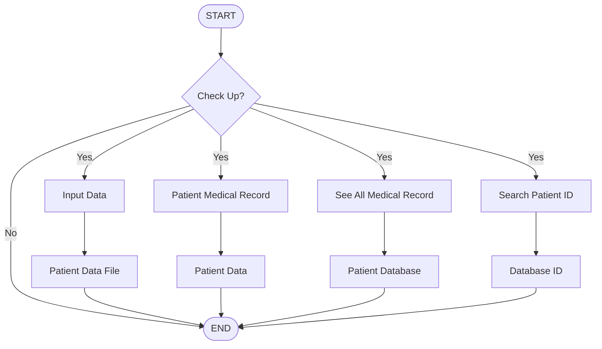

# Electronic Medical Record

## Final Project

### Overview

Electronic Medical Record is a simple application developed in C Programming Language to manage patient medical records. The system stores patient information using text files and allows users to create, search, and view medical records.

The application is designed to help manage patient data, symptoms, treatments, and medical history through a menu-driven interface.

---

## Features

The system provides four main functions:

### 1. Input Patient Data

- Create a new patient record
- Store personal information
- Record symptoms and treatments
- Record treatment effectiveness

### 2. Patient Medical Record

- Search patient records by ID
- View previous symptoms
- View complete medical history
- Search alternative treatments
- Add new medical records

### 3. View All Patient Records

- Display all stored patient records

### 4. Search Patient ID

- Search patient ID by keyword
- Display all registered patient IDs

---

## System Flow

1. User selects a menu option.
2. System processes the selected operation.
3. Patient information is stored in text files.
4. Records can be searched using patient ID.
5. Medical history can be reviewed and updated.

---

## Departments Available

The system supports the following medical departments:

- Neurology
- General Illness
- Eye Center
- Pulmology

Each department contains:

- Symptoms list
- Treatment recommendations

---

## File Structure

```text
MedicalRecordSystem/
│
├── main.c
├── database.txt
├── dataid.txt
├── datapenyakit.txt
│
├── NeurologySymptoms.txt
├── NeurologyTreatment.txt
│
├── GeneralSymptoms.txt
├── GeneralTreatment.txt
│
├── EyeSymptoms.txt
├── EyeTreatment.txt
│
├── PulmologySymptoms.txt
└── PulmologyTreatment.txt
```

### File Description

| File | Description |
|--------|-------------|
| database.txt | Stores all patient records |
| dataid.txt | Stores all patient IDs |
| datapenyakit.txt | Stores symptoms and treatment history |
| patientID.txt | Individual patient medical record |

---

## Technologies Used

- C Programming Language
- Standard C Library
- File Handling (`fopen`, `fprintf`, `fscanf`, `fclose`)
- String Functions (`strstr`, `strcpy`)

---

## How to Compile

Using GCC:

```bash
gcc main.c -o medical_record
```

---

## How to Run

Linux:

```bash
./medical_record
```

Windows:

```bash
medical_record.exe
```

---

## Sample Menu

```text
====================================================================================================
                                   WELCOME TO BME'S MEDICAL RECORD
====================================================================================================

                                             Menu:

                                    1. Input patient data

                                    2. Patient record

                                    3. See all patient medical record

                                    4. Search patient id record

====================================================================================================
```

## System Flowchart




---

## Authors

* Windy Deftia M
* Meilinda Anandita P

---

## License
Surabaya, 2016


###### This project was developed for educational and academic purpose only
